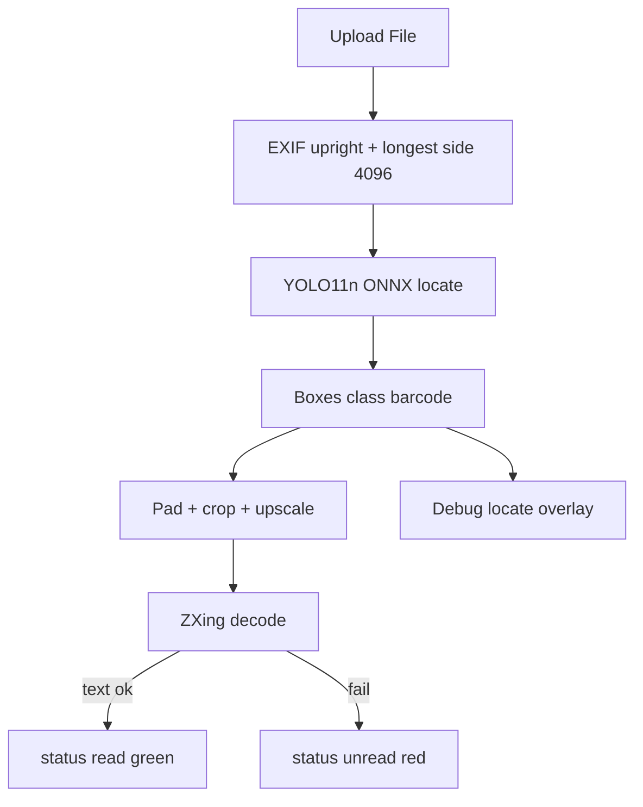

# YOLO11n barcode scan plan

**Status:** Ready to implement **when Colab training finishes** (blocked on weights)  
**Saved separately:** 2026-08-20  
**Canonical file:** `docs/yolo11n-barcode-scan-plan.md`

**Start gate:** Do not implement app YOLO path until you have `best.pt` and/or ONNX. When training is ready → drop weights + say “start the plan” / “implement”.

**Colab note (2026-08-20):** Training run name pattern `yolo11n_960-*` → train **imgsz=960**. Val cell must not hardcode `yolo11n_960-3` (runtime restart / new run → `-4`, `-5`, …). Use auto-find latest `best.pt` (see troubleshooting below).

---

## Summary

Google Colab లో **YOLO11n** ని `barcode_best_training_images` dataset మీద train చేసి, ఈ web app లో upload images మీద **localize → decode → green/red boxes** చేయడం.

| Step | Owner | Output |
|------|--------|--------|
| Train YOLO11n | You (Colab) | `best.pt` |
| Export ONNX | You (Colab) | `barcode-yolo11n.onnx` |
| App: load YOLO + ZXing + UI | This repo | Green = read, Red = located but unread |

---

## End goal

Upload చేసిన image లో:

1. YOLO11n అన్ని barcodes **localize** చేయాలి
2. ప్రతి box → crop → ZXing **decode**
3. Read OK → **green** box + value list
4. Locate OK, decode fail → **red** box
5. ముందు localization quality evaluate (“perfect ga localize avuthunda?”)

---

## Dataset (locked)

**Source:** `/Users/vijay/Downloads/barcode_best_training_images.zip`

| Item | Value |
|------|--------|
| Layout | YOLO (`images/train|val`, `labels/train|val`, `data.yaml`) |
| Images | **349** (train **280** / val **69**) |
| Class | **`0: barcode`** only (remapped) |
| Boxes | **934** · avg **2.68**/img · max **54** · **79** multi-object |
| Tiny codes | Common (p10 box area ≈ 0.3% of image) |
| Colab path in yaml | `/content/barcode_best_training_images` |

**Implications**

- Generic `barcode` class (1D + 2D) — not DataMatrix-only; ZXing still decides format/text
- Multi-code trays represented — fits “detect all”
- Tiny boxes → if YOLO11n@640 misses, try imgsz **1280** or **yolo11s**

---

## Train stack (locked)

- Platform: **Google Colab**
- Model: **YOLO11n** (`yolo11n.pt` → fine-tune)
- Start imgsz: **960** (your Colab runs are `yolo11n_960-*`; 640 was only an early default)

```bash
# unzip dataset to /content/barcode_best_training_images
yolo detect train model=yolo11n.pt \
  data=/content/barcode_best_training_images/data.yaml \
  imgsz=960 epochs=100 project=/content/runs/barcode name=yolo11n_960

yolo export model=/content/runs/barcode/yolo11n_960/weights/best.pt \
  format=onnx imgsz=960 simplify=True
```

### Colab troubleshooting: `best.pt` not found

Hardcoded path like `.../yolo11n_960-3/weights/best.pt` breaks when:

- Colab **runtime restarted** ( `/content` wiped )
- A new train created `yolo11n_960-4`, `-5`, etc.
- Train never finished / crashed before writing `best.pt`

**Use this val cell instead** (finds newest `best.pt` automatically):

```python
import os
from glob import glob
from ultralytics import YOLO

candidates = sorted(
    glob('/content/runs/barcode/**/weights/best.pt', recursive=True),
    key=os.path.getmtime,
)

if not candidates:
    print('No best.pt under /content/runs/barcode/')
    print('List what exists:')
    for root, dirs, files in os.walk('/content/runs'):
        for f in files:
            if f.endswith('.pt'):
                print(os.path.join(root, f))
    raise SystemExit('Re-run training, or remount Drive if weights were saved there.')

expected_model_path = candidates[-1]  # newest
print('Using:', expected_model_path)

best_model = YOLO(expected_model_path)
metrics = best_model.val(data='/content/data.yaml', imgsz=960)

print('mAP50:', float(metrics.box.map50))
print('mAP50-95:', float(metrics.box.map))
print('Precision:', float(metrics.box.mp))
print('Recall:', float(metrics.box.mr))
```

Also confirm `data.yaml` exists at `/content/data.yaml` (or pass the real path you used for train).

**Tip:** Save weights to Google Drive during train so restart doesn’t wipe them:

```python
# example: copy after train
# !cp -r /content/runs/barcode/yolo11n_960* /content/drive/MyDrive/barcode_yolo_runs/
```

App weights path: `models/barcode-yolo11n.onnx`  
Class map: `{ 0: "barcode" }`

---

## Will YOLO11n improve scanning?

**Locate:** usually yes vs classical proposals.  
**Decode:** only if boxes are tight → better crops for ZXing.  
**Nano:** fastest for browser; weakest on tiny/blurry codes.

Escalate if needed: `yolo11n @ 1280` → then `yolo11s @ 640`.

---

## App pipeline



### Android ingest parity (steps 1–2)

| Android | Web plan |
|---------|----------|
| Gallery → URI → bytes | File picker → `File` (already OK) |
| Longest side → 4096 | Keep `MAX_DIMENSION = 4096` |
| EXIF rotate upright | Add `createImageBitmap(..., { imageOrientation: "from-image" })` |

### Implementation todos

- [ ] **ingest-preprocess** — EXIF upright + keep 4096 in `lib/barcode/preprocess.ts`
- [ ] **yolo-export-contract** — `models/README.md`; expect `barcode-yolo11n.onnx`, class `barcode`
- [ ] **yolo-infer** — `lib/barcode/yolo-locate.ts` (ORT Web / Node, letterbox, NMS)
- [ ] **wire-decode** — each YOLO box → crop decode; read vs unread; optional full-frame ZXing fallback
- [ ] **types-ui** — `status: read | unread`; green/red in `ImagePreview`; unread count in results
- [ ] **loc-eval** — `scripts/eval-yolo-locate.mjs` + debug overlay on uploads
- [ ] **fallback** — classical proposals only if no weights / 0 YOLO hits
- [ ] **verify** — pharma/bottle fixtures + phone uploads after weights land

### Types (target)

```ts
export type BarcodeStatus = "read" | "unread";

export type ScanDetection = DetectedBarcode & {
  status: BarcodeStatus;
  score?: number;
  source?: "yolo" | "zxing-full" | "proposal";
};
```

### Key files to touch

- `lib/barcode/preprocess.ts`
- `lib/barcode/yolo-locate.ts` (new)
- `lib/barcode/detector.ts` / scan path
- `lib/barcode/types.ts`
- `components/ImagePreview.tsx`
- `components/BarcodeResults.tsx`
- `models/barcode-yolo11n.onnx` (you provide)
- `scripts/eval-yolo-locate.mjs` (new)

### Inference defaults

- Runtime: `onnxruntime-web` (browser), `onnxruntime-node` (eval script)
- Conf **0.25**, NMS IoU **0.45** (tune after eval)
- Output boxes in prepared-image pixels, then map for overlay

---

## Out of scope

- Training loop inside this Next.js app
- Live camera scanning
- Replacing ZXing with a learned decoder

---

## Waiting on you (then we start)

Colab train ready అయిన తర్వాత:

1. `best.pt` and/or ONNX file path (e.g. Downloads or `models/`)
2. Final train `imgsz` (640 / 1280 / …)
3. Val metrics if you have them (mAP / recall — optional)

Then say **start / implement** — we wire YOLO11n locate → ZXing decode → green/red UI per this plan.

---

## Related

- Cursor plan mirror: `.cursor/plans/unread_barcode_boxes_8501c938.plan.md`
- Older draft name: `docs/image-pipeline-plan.md` → points here
